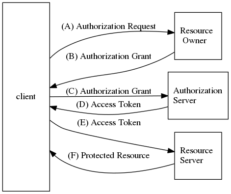

# OAuth

> 参考文档： [The OAuth 2.0 Authorization Framework](https://tools.ietf.org/html/rfc6749)

## 解决的问题

OAuth是用于授权的开放网络标准，当前版本2.0。OAuth允许第三方应用从一个http server获取有限的访问权限；传统认证方式，用户需要把自己的认证凭证（通常是密码）共享给第三方应用这会有一系列问题：
* 第三方应用会存储用户的证书（密码）
* 每个服务器都需要支持密码验证
* 第三方应用会拥有用户所有资源的权限
* 除非修改密码，否则用户无法收回权限

OAuth在资源服务器和客户端之间添加了Authorization层， 在OAuth中客户端发往资源服务器的凭证与资源所有者所持有的凭证是不同的。

## auth定义了四种角色

* Resource Owner: 资源完整权限的所有者，即用户(End-user)
* Resource Server: 资源服务器, 接收token返回被保护的资源
* Client: 请求被保护资源的应用
* Authorization server: 鉴权服务器

## 其他名词
* Third-party: 第三方应用
* Http server: http 服务提供商
* User Agent: 用户代理，用户用来访问api的客户端

## OAuth2 的流程如下图

* A. 客户端想权限所有者请求权限
* B. 用户返回授权(四种授权类型中的一种)
* C. 客户端把用户授权发送给权限服务
* D. 权限服务返回Access Token
* E. 客户端先资源服务器请求受保护的资源
* F. 验证token之后资源服务返回资源

## Grant types

Authorization Grant 是用来代表用户的授权的凭证，分为四种类型：

1. Authorization Code: 授权码
2. Implicit: 简化授权码模式
3. Resource owner password credentials: 密码模式
4. Client credentials: 客户端模式

